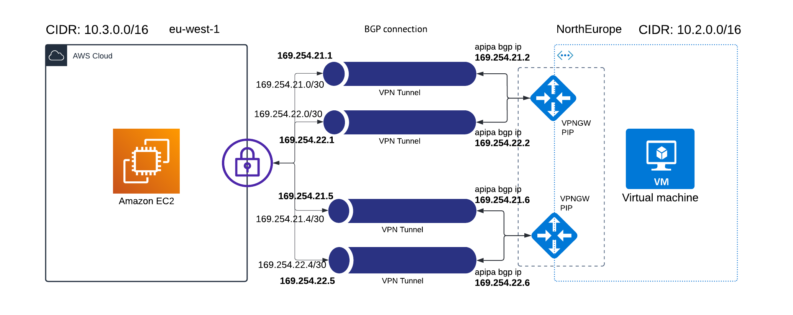
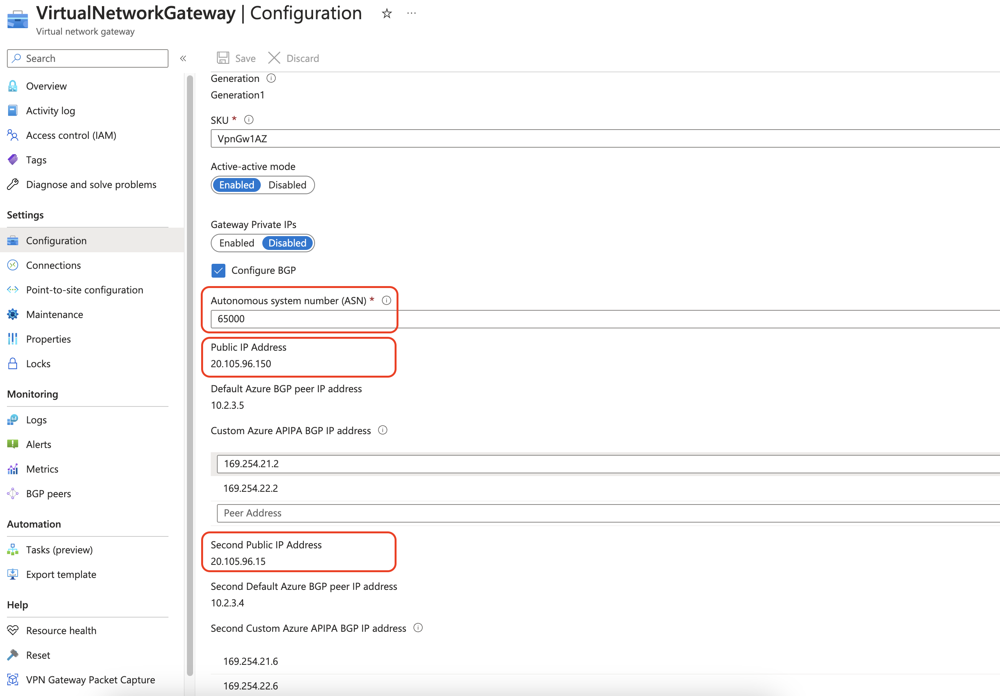
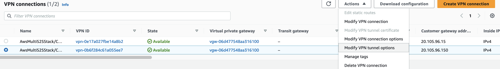
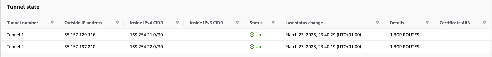
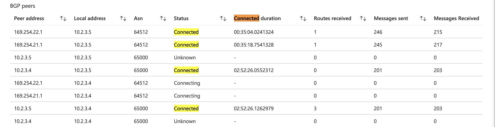

# aws - azure bgp enabled vpn connection

This guide helps on implementing bgp-enabled vpn connection between AWS and Azure.

- A simplified way of this [article](https://learn.microsoft.com/en-us/azure/vpn-gateway/vpn-gateway-howto-aws-bgp).
- Here, executing scripts in [CDK](https://docs.aws.amazon.com/cdk/v2/guide/getting_started.html) and [terraform](https://developer.hashicorp.com/terraform/tutorials/azure-get-started) (widely used with it's pace).


  - On AWS side in [CDK](https://github.com/sree7k7/AWS-multi-S2S) (python).
  - Azure side in [terraform](https://developer.hashicorp.com/terraform/tutorials/azure-get-started).

## Run

  - [Prerequsites](#prerequsites)
  - [Purpose](#purpose)
  - [Execute scripts](#execute-scripts)
    - [Azure](#azure)
    - [AWS](#aws)
  - [Configuration](#configuration)
  - [Verify the connections](#verify-the-connections)
  - [Clean up](#clean-up)



## Prerequsites

- AWS in [CDK](https://docs.aws.amazon.com/cdk/v2/guide/getting_started.html)
- Azure in [terraform](https://developer.hashicorp.com/terraform/tutorials/azure-get-started)
- [azure cli](https://learn.microsoft.com/en-us/cli/azure/install-azure-cli) & [sign in](https://learn.microsoft.com/en-us/cli/azure/authenticate-azure-cli)

## Purpose

To connect multi (aws) tunnels/sites for network redundancy using active-active bgp-enabled azure vpn gateway.
And to avoid active-passive connection with one custom BGP ip on azure vpn gateway.

## Execute scripts

#### Azure

1. Clone [this](https://github.com/sree7k7/AWS-Azure-bgp-connection) and deploy the code as it is (using terraform). Later, change the parameters (ip's).

2. execute below cmds:

```terraform
terraform init
terraform apply
```

> **Note**: If fails, try to execute: **terraform init -upgrade** on terminal and execute cmd: **terraform apply**.

3. Copy the ASN and public ip's of vpn gateway for instanc0, 1.



#### AWS

4. Clone [this](https://github.com/sree7k7/AWS-multi-S2S) repo and deploy (*It will provision: two customer gateways (CGW's), VGW, two S2S connections, VPC, public/private subnets, EC2*).

5. In ***parameters.p***y file change the ip's. *VPNGWinstance0_pip* and
*VPNGWinstance1_pip*. which you copied in above step [3](#3) — (*see pic*).

```python
# AWS VPC
regionName = "eu-west-1"
vpc_cidr = "10.3.0.0/16"
cidr_mask = 24
VPNconnetion1Tunnel1 = "169.254.21.0/30"
VPNconnetion1Tunnel2 = "169.254.22.0/30"

VPNconnetion2Tunnel1 = "169.254.21.4/30"
VPNconnetion2Tunnel2 = "169.254.22.4/30"      

# destination network
destinationCIDR = "10.2.0.0/16"
VPNGWinstance0_pip = "20.105.96.150"
VPNGWinstance1_pip = "20.105.96.15"
```

6. Execute the following commands in terminal.

```python
python3 -m venv .venv
source .venv/bin/activate
pip install -r requirements.txt
cdk deploy
```

## Configuration

- In AWS Copy the both outside tunnel ip's.
  - In AWS management console. Navigate to Vpc → site-to-site connections → choose the tunnel.
- Get the PSK for Tunnel-1 and Tunnel-2.
  - In AWS management console. Navigate to Vpc → site-to-site connections → choose the tunnel → click: Actions → Modify VPN tunnel options.
  
- Give/paste the AWS tunnel public-ip's and PSK secrets to Azure VPN connections. (doable manually or through code).
  - In ***variable.tf*** file modify the variables (received from [aws](#aws)): *vpn_gateway_pip_tunnel1*, *vpn_gateway_pip_tunnel2*,
  *shared_key_tunnel1* and *shared_key_tunnel2*
- execute: `terraform apply`

## Verify the connections

- Check the AWS tunnels are up for both connections.
- Check the Azure VPN gateway connections.

- Check the BGP peers status on Azure.

- Connect the azure VM using bastion host.
  - username: `demousr`
  - passowrd: `Password@123`
- Reachout/ping the destination vm using private ip.

## Clean up
- In terminal execute the following command:
```azcli
az group delete -g "aws-azure-bgp" --no-wait
```