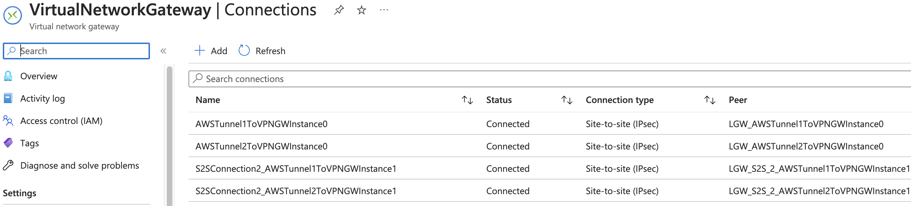
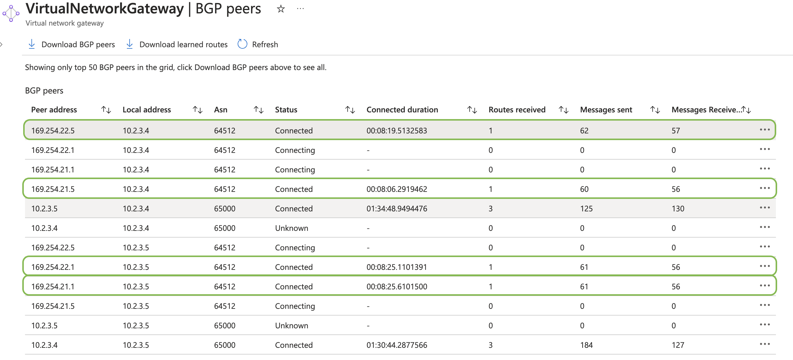

# aws - azure bgp enabled connection

This guide helps on implementing bgp-enabled vpn connection between AWS and Azure.

- A simplified way of this [article](https://learn.microsoft.com/en-us/azure/vpn-gateway/vpn-gateway-howto-aws-bgp), progressing in Terraform (widely used with slow pace).

- The scripts are in cd.and terraform:
  - - On AWS side in [CDK](https://github.com/sree7k7/AWS-multi-S2S) (python)
  - - Azure side in [terraform](https://developer.hashicorp.com/terraform/tutorials/azure-get-started).

## Run

- Purpose
- Execute scripts
- Configuration
- Verify the connection


## Prerequsites

- AWS in [CDK](https://docs.aws.amazon.com/cdk/v2/guide/getting_started.html)
- Azure in [terraform](https://developer.hashicorp.com/terraform/tutorials/azure-get-started)
- [azure cli](https://learn.microsoft.com/en-us/cli/azure/install-azure-cli) & [sign in](https://learn.microsoft.com/en-us/cli/azure/authenticate-azure-cli)

## Purpose

To connect multi (aws) tunnels/sites for redundancy with active-active bgp-enabled azure vpn gateway.
And to avoid active-passive connection with one custom BGP ip on azure vpn gateway.

## Execute scripts

Azure

1. Clone [this](https://github.com/sree7k7/AWS-Azure-bgp-connection) and deploy the code as it is (using terraform). Later, change the parameters (ip's).

2. execute below cmds:

- terraform init
- terraform plan
- terraform apply

**Note**: If fails, try to execute: **terraform init -upgrade** on terminal and execute cmd: **terraform apply --auto-approve**.

- Copy the public ip's of vpn gateway for instanc0, 1.
- Copy the ASN.


AWS

3. Clone [this](https://github.com/sree7k7/AWS-multi-S2S) repo and deploy.

4. Execute the following commands in terminal.

```
python3 -m venv .venv
source .venv/bin/activate
pip install -r requirements.txt
```

- In parameters.py file change the ip's. *VPNGWinstance0_pip* and
*VPNGWinstance1_pip*. which you copied in above step (see pic).

```
# AWS VPC
regionName = "eu-west-1"
vpc_cidr = "10.3.0.0/16"
cidr_mask = 24
VPNconnetion1Tunnel1 = "169.254.21.0/30"
VPNconnetion1Tunnel2 = "169.254.22.0/30"

VPNconnetion2Tunnel1 = "169.254.21.4/30"
VPNconnetion2Tunnel2 = "169.254.22.4/30"      

# destination network
VPNGWinstance0_pip = "20.105.96.150"
VPNGWinstance1_pip = "20.105.96.15"
destinationCIDR = "10.2.0.0/16"
```

## Configuration

**Note**: This configuration is for bgp-enabled azure vpn gateway **instance0**.

- In AWS Copy the both outside tunnel ip's.

- Get the PSK for Tunnel-1 and Tunnel-2.
  - - In AWS management console. Navigate to VPN -> site-to-site -> choose the tunnel -> click: Actions -> Modify VPN tunnel options.
- Give/paste the AWS tunnel public-ip's and PSK secrets to Azure VPN connections. (doable manually or through code).
  - - In variable.tf file modify the variables: *vpn_gateway_pip_tunnel1*, *vpn_gateway_pip_tunnel2*,
  *shared_key_tunnel1* and *shared_key_tunnel2*
- execute: `terraform apply`

## Verify the connections

- Check the AWS tunnels are up..
- Check the Azure VPN gateway connections. 

- Check the BGP peers status on Azure.
